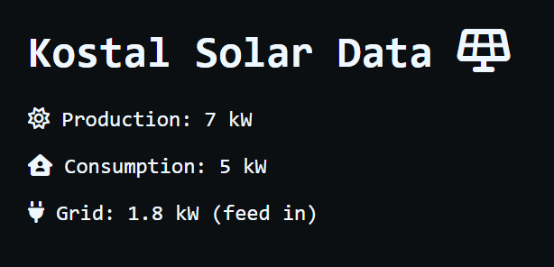

# KostalWebApiFrontend

# Overview



# Deployment / Installation

## Deploy with Docker

Sample Docker Compose file:
`./data/html` can be Replaced with the path to the Folder housing the index.html
```yaml
version: "3.9"

services:
  web:
    image: nginx:latest
    network_mode: bridge
    ports:
      - 1009:80
    volumes:
      - ./data/html:/usr/share/nginx/html:ro
      - ./data/config/nginx.conf:/etc/nginx/nginx.conf:ro
```
Sample nginx.conf
```

user  nginx;
worker_processes  auto;

error_log  /var/log/nginx/error.log notice;
pid        /var/run/nginx.pid;


events {
    worker_connections  1024;
}


http {
    include       /etc/nginx/mime.types;
    default_type  application/octet-stream;

    log_format  main  '$remote_addr - $remote_user [$time_local] "$request" '
                      '$status $body_bytes_sent "$http_referer" '
                      '"$http_user_agent" "$http_x_forwarded_for"';

    access_log  /var/log/nginx/access.log  main;

    add_header Content-Security-Policy "default-src 'none'; font-src 'self'; img-src 'self'; object-src 'none'; script-src 'self'; style-src 'self'; connect-src https://solarapi.niei.net/data 'self'; base-uri 'none'; form-action 'none'; frame-ancestors 'none'";
    add_header Strict-Transport-Security "max-age=1000";
    add_header X-Xss-Protection "1; mode=block";
    add_header X-Frame-Options "DENY";
    add_header X-Content-Type-Options "nosniff";
    add_header Referrer-Policy "strict-origin-when-cross-origin";

    sendfile        on;
    #tcp_nopush     on;

    keepalive_timeout  65;

    #gzip  on;

    include /etc/nginx/conf.d/*.conf;
}
```
